## 《计算机网络》第七章：应用层（The Application  Layer）

* Copyright(C)肖文栋教授@北京科技大学自动化学院

# 7 The Application Layer

* 7.1 DNS—the Domain Name System
* 7.2 Electronic Mail
* 7.3 The World Wide Web

## Application

* – running in network hosts in “user space”

* – exchange messages to implement app

* – e.g., email, file transfer, the Web

## Application-layer protocols

* – one “piece” of an app
* – define messages exchanged by apps and actions taken
* – use services provided by lower layer protocols

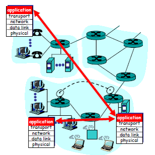

# 7.1 DNS—the Domain Name System域名系统

* 7.1.1 The DNS Name Space
* 7.1.2 Domain Resource Records
* 7.1.3 Name Servers

## 产生原因

* 计算机网络地址(如IP)难于记忆，应该使用符号地址，比如用www.ustb.edu.cn表示USTB的IP地址。

* 但是，网络本身是使用IP地址的，因此需要一个完成二者之间相互转换的机制。

* 当网络规模比较小时，例如ARPANET，每台主机只需查找一个文件（UNIX的host），该文件中列出了主机与IP地址的对应关系。

* 当网络规模很大时，上述方法就不适用了，因此产生了域名系统DNS（Domain Name System）。

## DNS概述

* 域名系统是一个多层次的、基于域的命名系统，并使用分布式数据库加以实现。

* 为了将符号名影射成IP地址，

–应用程序需要调用解析器（resolver），
–解析器向本地DNS发出请求，
–本地DNS查询该名字，并返回包含对应的IP地址的响应报文给解析器。
–解析器将IP地址返回给调用方。

* 请求和响应均以UDP包格式发出。

* 有了IP地址后，应用程序可以与目标机建立TCP连接，或给它发送UDP数据包

# 7.1.1 The DNS Name Space名字空间

* 250个顶级域名

* 这些域又被进一步划分成子域，这些子域可被再次划分，以此类推

* 顶级域名分为通用的和国家/地区的两种。每个域对它下面的子域和机器进行管理。

* DNS中，每台计算机的名字是由“.”所分开的字符数字串所组成的。例如www.ustb.edu.cn.

* 域名是大小写无关的，“edu”和“EDU”相同。域名最长255个字符，每部分最长63个字符。

* 层次型命名机制

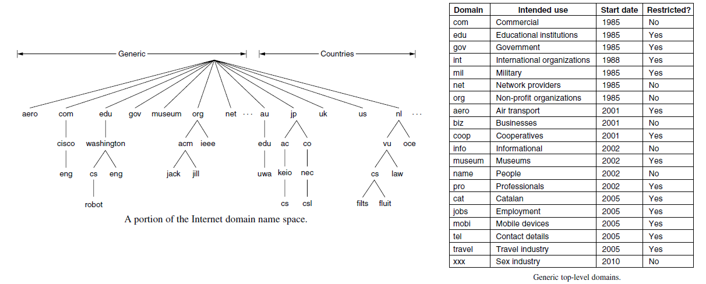

## Internet的域名结构

域的层次数可以是二层、三层或多层；为保证全球域名的统一性，因特网规定顶层域名。

美国是Internet发源地，美国的顶级域名以组织模式划分：

* Net 网络组织；
* edu 教育部门；
* gov 政府部门；
* mil 军事部门；
* com 商业组织；
* org 非政府组织；
* int 国际组织

其他国家或地区顶级域名以地理模式划分：

* cn 中国；
* jp 日本；
* hk 香港；
* fr 法国；
* uk 英国；

网络信息中心将顶级域的管理权授予指定的管理机构，各个管理机构再为他们所管理的域分配二级域名，并将二级域名的管理权授予其下属的管理机构。

中国互联网信息中心负责管理我国的顶级域，将cn域分为多个二级域名

* Net 网络支持中心；
* edu 教育部门；
* gov 政府部门；
* ac 科研机构；
* com 商业组织；
* org 各种非赢利性组织；
* int 国际组织；

## 组织内的域名

一旦一个组织拥有一个域的管理权，就可以决定是否需要进一步划分层次。因此，Internet树状层次结构的命名方法，使得任何一个连接到Internet的主机都有一个全网唯一的域名

主机域名的一般格式：…….四级域名.三级域名.二级域名.顶级域名

中国互联网信息中心CNNIC将我们教育机构的二级域（edu域）的管理权授予中国教育科研网CERNET网络中心；CERNET网络中心将edu域化分为多个三级域，并将三级域名分配给各个大学与教育机构。例如，edu域下的ustb代表北京科技大学，并将ustb域的管理权授予北科大网络管理中心。网络管理中心又将ustb域划分成多个四级域，将四级域名分配给下属部门或主机

```www.ustb.edu.cn```

* EDU.CN是CN的子域；USTB.EDU.CN是EDU.CN的子域。
* 第一级域“cn”表示这是中国；
* 第二级域“edu.cn”表示这是中国教育部门；
* 第三级域“ustb.edu.cn”表示是中国教育部门下属的、英文缩写为ustb的学校；
* Www是该校园网中的一台服务器或主机；

* “域”，域名中每一个标号右面的标号和点；

# 7.1.2 域名资源记录

* 在DNS的数据库中用资源记录来表示主机和子域的信息，当应用程序进行域名解析时，得到的便是域名所对应的资源记录。

* 资源记录是一个五元式

Domain_name Time_to_live Class Type Value

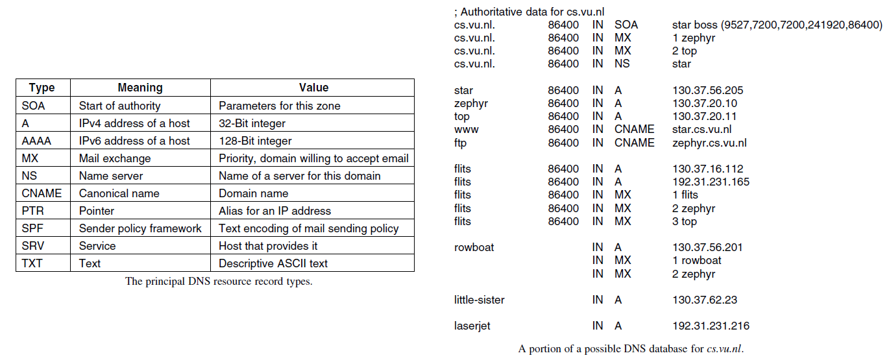

# 7.1.3 域名服务器

*  DNS将域名空间划分为许多无重叠的区域(zone) ，每个区域覆盖了域名空间的一部分并设有域名服务器对这个区域的域名进行管理。

*  每个区域有一个主域名服务器和若干个备份域名服务器，区域的边界划分是人工设置的，比如：edu.cn ustb.edu.cn是两个不同的区域，分别有各自的域名服务器。

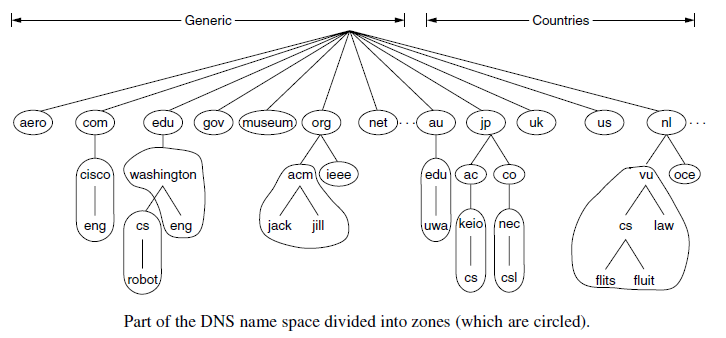

## 域名解析：将域名转为对应IP地址

*  当解析器需查询一个域名时，首先将该查询传递给本地域名服务器

*  如果域名属于本地域名服务器的管辖范围，在本地数据库中查找该域名对应的IP地址，直接回答该请求

*  如果请求中的域名在远端，域名服务器将启动一次远程查询。采用迭代查询方法。这是由于许多域名服务器太忙了，该方法把重负压在了查询发起方。

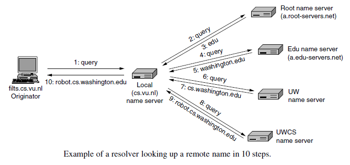

域名解析算法

-递归查询（recursive query）：从顶开始解析，要求名字服务器系统一次性完成全部名字—地址变换；

-迭代查询（iterative query）：从本域名服务器查询开始，每次请求一个服务器，如果不行，再请求别的服务器；

两者区别：

-递归解析：任务主要由服务器软件承担；

-重复解析：任务主要由域名解析器软件承担；

# 7.2 Electronic Mail*

* 7.2.1 Architecture and Services
* 7.2.2 The User Agent
* 7.2.3 Message Formats
* 7.2.4 Message Transfer
* 7.2.5 Final Delivery

## 电子邮件

电子邮件的应用

E-mail服务，为Internet用户之间发送和接收信息提供了一种快捷、廉价的现代化通信手段

电子邮件地址：Username@Hostname.Domain-name

* Username:用户名，代表用户在邮箱中使用的账号；

* Hostname：用户邮箱所在的邮件服务器的主机名；

* Domain-name：邮件服务器所在的域名；

* 如某台邮件服务器主机名为mail，该服务器所在域名为```ustb.edu.cn```，在该服务器上有一个邮件用户，用户名为```wang```；该用户的电子邮件地址为```wang@mail.ustb.edu.cn```；

# 7.2.1 Architecture and Services

* 用户代理：允许用户阅读和发送电子邮件，一般为用户进程；

* 邮件传输代理（邮件服务器）：将邮件从源端发送至目的端，一般为系统的后台进程；采用协议SMTP

* 简单邮件传输协议SMTP（Simple Mail Transfer Protocol）


## 电子邮件系统提供的功能

* 电子邮件系统提供的基本功能

–成文：指创建消息或回答消息的过程；

–传输：指将消息从发送者传出至接收者；

–报告：将消息的发送情况报告给消息发送者；

–显示：使用相应的工具软件将收到的消息显示给接收者

–处理：接收者对接收到的消息进行处理，存储/丢弃/转发等等。

* 其它高级功能

–mailbox，创建邮箱存储邮件；

–mailing list；

–抄送（cc）、高优先级、加密。

–休假代理

# 7.2.2 用户代理（电子邮件阅读器）

* 主要功能

–发送电子邮件

* email地址，例如，```webmaster@ustc.edu.cn```

* mailing list，例如，```students@mail.ustc.edu.cn```

–阅读电子邮件

* 用户代理在启动时检查用户的mailbox，通知用户是否有新邮件到来。并摘要性的显示邮件的主题、发送者及其邮件的状态。

–例子：gmail, outlook, 163, foxmail等

# 7.2.3 Message Formats

RFC 5322（最新）—The Internet Message Format 
邮件由信封、数个头字段、一个空行和邮件体构成。


## MIME多用途Internet邮件扩展

MIME（Multipurpose Internet Mail Extensions），增加了对图像、声音、视频、可执行文件等的支持。为传送非ASCII码的邮件定义了编码规则。

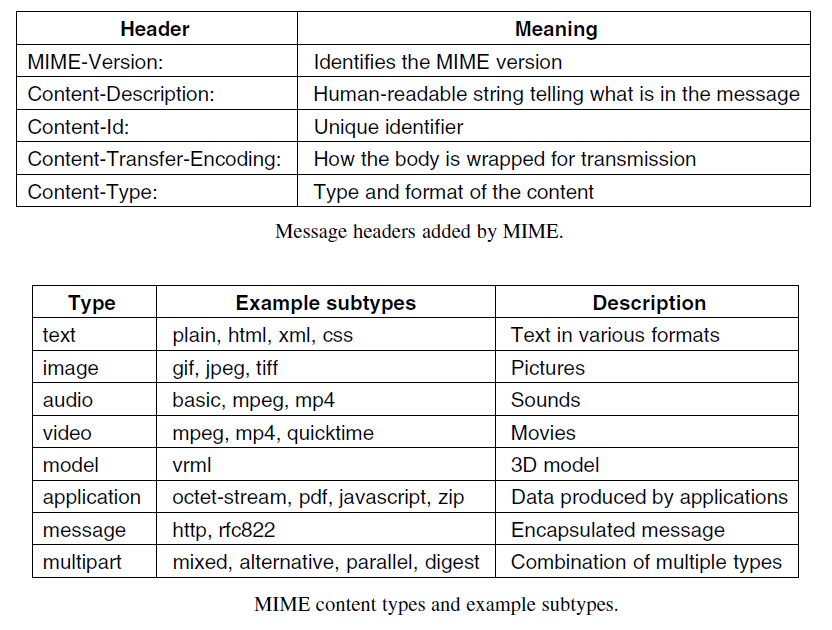

# 7.2.4 Message Transfer

* INTERNET使用简单邮件传输协议SMTP完成电子邮件的交换。

* 过程如下

–消息传输代理在源端主机和目的主机的25号端口之间建立一条TCP连接，使用简单邮件传输协议SMTP协议进行通信；
–在TCP连接建立好之后，作为客户的邮件发送方等待作为服务器的邮件接收方首先传输信息；
–服务器首先发出准备接收的SMTP消息，表明自己的标识并准备好接收邮件；
–客户声明邮件的发信人地址及收信人的地址，服务器确认收信人存在后，则指示客户发送邮件；
–客户发送邮件，服务器予以确认
–两个方向的发送完成之后，释放连接。


# 7.2.5 最后传递FinalDelivery

IMAP—The Internet Message Access Protocol

Internet邮件访问协议

* To use IMAP, the mail server runs an IMAP server that listens to port 143.

* Theuser agent runs an IMAP client.

* The client connects to the server and begins toissue commands from those listed in Fig. 7-17.

## IMAP

IMAP是较早使用的最终交付协议POP3的改进版。POP3通常将邮件下载到计算机上，而不是留在服务器上，使用非常不方便。

* First, the client will start a secure transport if one is to be used (in order tokeep the messages and commands confidential), and then log in or otherwiseauthenticate itself to the server.

* there are many commands to list folders and messages, fetch messages or even parts of messages, mark messages with flags for later deletion, and organize messages into folders.

* IMAP has many other features, e.g.,

–to address mail by using attributes (e.g., give me the first message from Alice).
–to perform searches on the server to find the messages that satisfy certain criteria so that only those messages are fetched by the client.

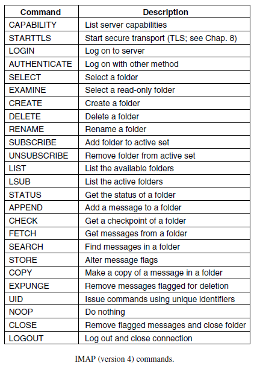

# 7.3 The World Wide Web

7.3.1 Architectural Overview
7.3.2 Static Web Pages
7.3.3 Dynamic Web Pages and Web Applications
7.3.4 HTTP—The HyperText Transfer Protocol
7.3.5 The Mobile Web
7.3.6 Web Search

* WWW（World Wide Web）是用于访问遍布于INTERNET上的相互链接在一起的超文本的一种结构框架。

* 历史

* –1989年，设计WWW的思想产生于欧洲核研究中心CERN；
* –1991年，第一个原型在美国的Hypertext ’91会议上展示；
* –1993年，第一个图形化浏览器，Mosaic；
* –1994年，Andreessen创建NETSCAPE公司，开发WEB的客户和服务器软件；其后和微软的IE浏览器进入了一场浏览器大战
* –1994年，CERN和MIT共同创建WWW论坛，制定相关的协议标准，http://www.w3.org。

许多新想法丰富着WWW世界，并来自于年轻的学生。如,
Mark Zuckerberg开始创建Facebook时是Harvard学生, Sergey Brin及Larry Page创建Google时是Stanford学生。

# 7.3.1 Architectural Overview

* WWW是由互相链接在一起的网页构成的，这些网页是由普通文本、超文本Hypertext，以及图表、照片等构成；

* 用户通过称为浏览器（如IE）的软件来观看网页，浏览器取回所请求的网页，解释其中所含的文本和格式命令，并正确地显示出来；

* 网页中的文本串若指向其它的网页（此指针称为超级链接Hyperlink，此文本串称为超文本），会被特别地显示出来（加下划线），用户若选择此超级链接，浏览器会将此超级链接所指的网页取回；

* 当超文本网页中包含声音、动画等其它媒体时，网页被称为是超媒体的。浏览器一般通过外挂的帮助程序来显示这些超媒体信息。

* 每一页的抓取都是通过发送请求到服务器，服务器以页面的内容作为响应。所用协议为HTTP超文本传输协议。

## Architectural Overview


## 客户端

* 使用URL（统一资源定位符）来找到目标网页的。URL由三部分组成：

–协议类型（HTTP超文本传输协议、FTP、TELNET等）；
–网页所在机器的DNS域名；
–包含网页的文件名称。

如：```http://www.cs.washington.edu/index.html```

* 获取超级链接的步骤：

–浏览器确定URL，
–通过DNS解析IP地址，
–建立TCP连接，
–向服务器发出HTTP报文请求网页，
–服务器发回网页作为HTTP响应，
–浏览器显示页面，
–释放连接。

## 某些公共的URL方案

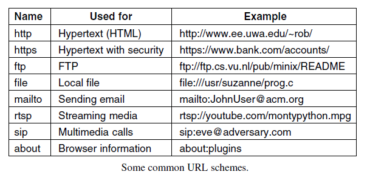

## MIME类型

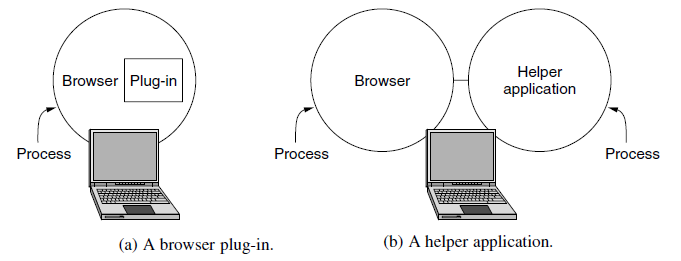

## 服务器端

服务器在它的主循环中执行如下步骤：

* 接收来自客户端（浏览器）的TCP连接，
* 获取页面的路径，即被请求文件的名字，
* 获取文件（通常从磁盘上），
* 将文件内容发送给客户，
* 释放TCP连接。

## 服务器端处理多个请求

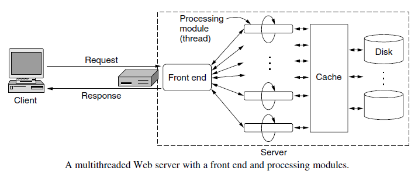

## 服务器端

服务器对每个请求的实际处理过程：

* 解析被请求的页面的名字
* 执行对该页面的访问控制
* 检查缓存
* 从磁盘上获取请求的页面或运行一个创建页面的程序，
* 确定响应中的其余部分（比如要发送的MIME类型）
* 把响应返回给客户
* 在服务器的日志中增加一个表项

# 7.3.2 Static Web Pages

* WWW的基础是将页面从服务器传到客户端。
* 在最简单的形式中，web的页面是静态的，即其为服务器上的文件。
* 每次被客户端获取或显示的方式是一样的。

## HTML----超文本标记语言

* 包含了格式化的显式命令，如<b>表示粗体字型的开始，<\b>表示其结束。
* 可用任何文本编辑器编写HTML文档，也可用文字处理器或专用的文本编辑器来处理, 如Macromedia Dreamweaver。

## HTML----超文本标记语言输出

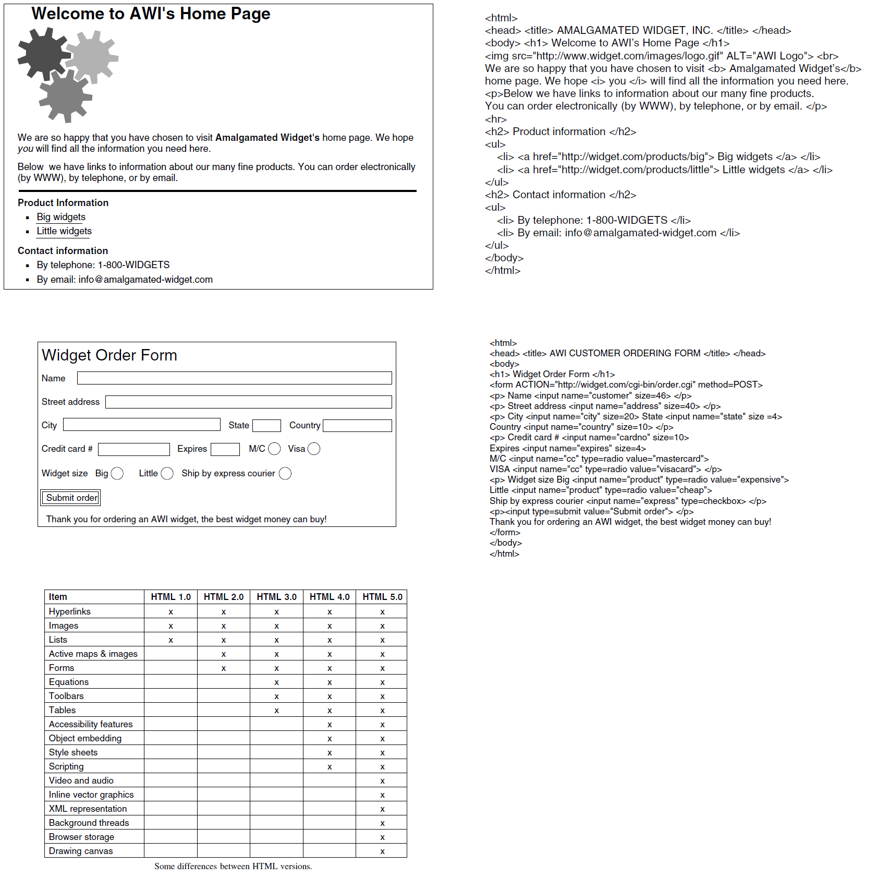

## CSS层叠样式表

更好地控制格式，同一格式可被多个网页应用

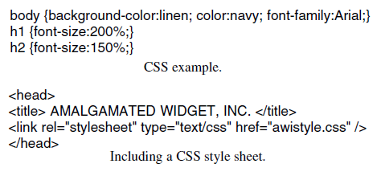

# 7.3.3 Dynamic Web Pages and Web Applications

WWW用作应用程序及服务：

* 在电子商务网站购买产品
* 检索图书馆书目
* 搜索地图
* 阅读和发送电子邮件
* ……

## Dynamic Web Pages: 如地图服务

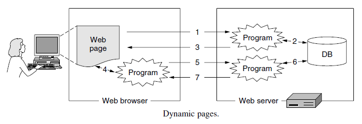

* 直接返回页面
* 页面中包含应用程序

## 服务器端动态Web页面生成

服务器必须能处理表单的使用, 如前面的例子中用到的```http://widget.com/cgi-bin/order.cgi``` 及POST

两种典型的处理动态页面请求的方法：

* 公共网关接口CGI (Common Gateway Interface)

-提供接口，允许Web服务器与后端程序及脚本通信
-后端程序及脚本接受输入信息，生成HTML页面作为响应
-通常用脚本语言开发，如Python, Ruby, Perl等
-调用的程序(如order.cgi)通常放在cgi-bin目录下

* 在页面中嵌入少量的脚本，让服务器执行这些脚本一边生成最终发给客户的页面，如超文本预处理器PHP（Hypertext Preprocessor），服务器用扩展名php标识包含PHP的页面

## 服务器端动态Web页面生成：PHP


## 服务器端动态Web页面生成

其它可选技术：

* Java服务器页面JSP，与PHP类似，Java编写，扩展名jsp

* 活动服务器页面（ASP.NET）,Microsoft版本（应用.NET）的PHP及JSP,，扩展名aspx

## 客户端动态Web页面生成

* PHP与CGI不能响应鼠标移动事件，或直接与用户交互，有必要在HTML嵌入脚本

* 这些脚本必须运行在客户端

* 产生这种交互式页面的技术统称为动态HTML

* 最流行的客户端脚本语言为Javascript

## 客户端动态Web页面生成: Javascript

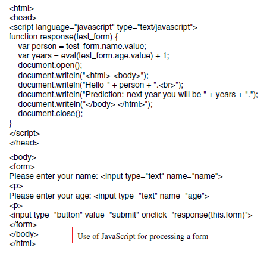

## PHP与Javascript


## 客户端动态Web页面生成

其它方法：

* VBScript，基于VisualBasic

* Applet，基于Java，被编译成Java虚拟机。Applet可嵌入到HTML页面中，并被具有JVM的浏览器解释执行

* Microsoft的ActiveX控件，是一种被编译成x86机器指令的程序

Asageneralrule,JavaScriptprogramsareeasiertowrite,Javaappletsexecutefaster,andActiveXcontrolsrunfastestofall.

## AJAX----异步Javascript和XML

* 客户端的脚本（如Javascript）通常和服务器上的脚本通常和其它几个关键技术结合起来使用，这些技术的组合称为AJAX----异步Javascript和XML

* 许多全功能的应用，如Google的gmail、Maps、Docs等均由AJAX编写

* AJAX不是一种语言，而是一组需要一起协同工作的技术，包括：

1.HTML and CSS to present information as pages.
2.DOM (Document Object Model) to change parts of pages while theyare viewed.文档对象模型，浏览时可改变部分页面
3.XML (eXtensible Markup Language) to let programs exchange applicationdata with the server.可扩展标记语言
4.An asynchronous way for programs to send and retrieve XML data.
5.JavaScript as a language to bind all this functionality together.

## 文档对象模型DOM

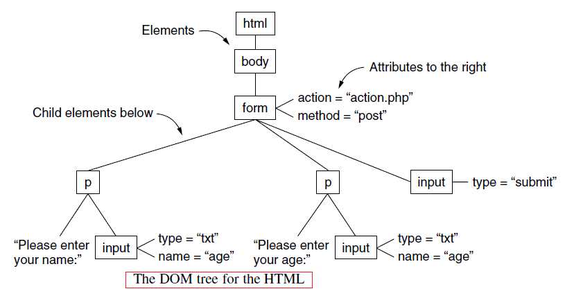

## 可扩展标记语言XML

* HTML将内容及格式混合在一起，关注的是信息的表示

* 许多Web应用程序需要将独立的结构化内容从它的表示中分离开来

* XML是一种说明结构化内容的语言

* XML没有定义任何标签，用户可以定义自己的标签

* XML中的字段可以进一步划分


* XML容易被程序分析

* HTML也可按照XML术语来定义，该方法称为扩展超文本标记语言XHTML

* XML可用作程序之间的流行通信语言，当这种通信由HTTP协议承载时，就被称为一种Web服务（WebService）

* 简单对象访问协议SOAP (Simple ObjectAccess Protocol)是一个实现了与语言与系统无关的Web服务的方法。

The client just constructsthe request as an XML message and sends it to the server, using the HTTPprotocol. The server sends back a reply as an XML-formatted message. In thisway, applications on heterogeneous platforms can communicate.

## 用来生成动态页面的不同技术

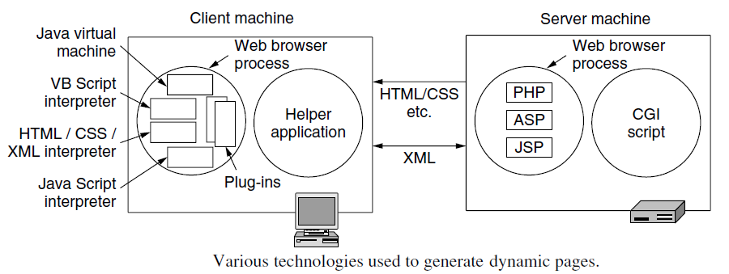

# 7.3.4 HTTP—The HyperText Transfer Protocol

* HTTP是一个应用层协议，运行在TCP之上，并且与Web密切相关

* HTTP越来越像一个传输层协议，可支持多种应用层服务，如媒体播放器与服务器通信并请求专辑信息。

## HTTP的连接

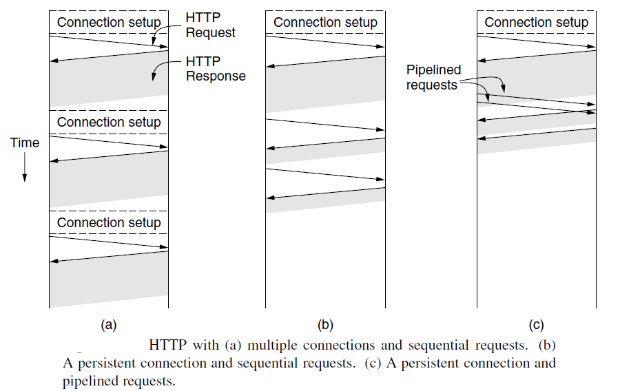

## HTTP的方法：支持的操作 和 HTTP的缓存


# 7.3.5移动Web

Compared to desktop computers, mobile phones presentseveral difficulties for Web browsing:

* Small screens preclude large pages and large images.
* Limited input capabilities make it tedious to enter URLs or otherlengthy input.
* Network bandwidth is limited over wireless linksand expensive, particularly on cellular(3G) networks.
* Connectivity may be intermittent.
* Computing power is limited, for reasons of battery life, size, heatdissipation, and cost.

## 移动Web

* The approach that is increasingly used is to run the same Web protocols for mobiles and desktops, and to have Web sites deliver mobile-friendly content when the user happens to be on a mobile device.
* Web servers are able to detect whether to return desktop or mobile versions of Web pages by looking at the request headers.
* Thus, when a Web server receives a request, it may look at the headers and return a page with small images, less text, and simpler navigation to an iPhone and a full-featured page to an user on a laptop.
